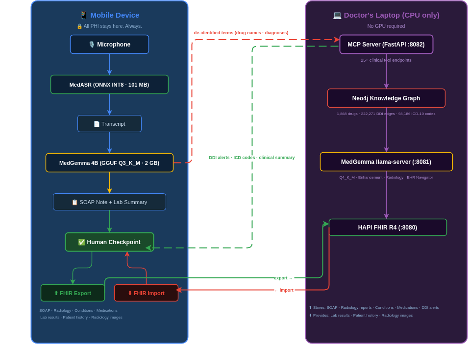

<div align="center">

# 💊 Capsule

### AI-Powered Clinical Documentation — Edge-First, Privacy-Guaranteed


**MedGemma Impact Challenge — Edge AI Prize Submission**

[🎬 Demo Video](#demo) • [✨ Features](#features) • [🏗️ Architecture](#architecture) • [🚀 Setup](#setup) • [📁 Structure](#structure)

</div>

---

## 🎯 Overview

Capsule turns a **30-second voice dictation** into a complete, safety-reviewed clinical note — running MedGemma and MedASR **entirely on the doctor's devices**, with no patient data ever leaving the clinic.

Doctors spend 2+ hours daily on documentation. Capsule cuts that to minutes while **autonomously detecting drug interactions, suggesting billing codes, and correlating lab results** — all with mandatory physician review before any data is committed.

### Key Innovation

Unlike cloud-based AI scribes, Capsule enforces a strict **privacy boundary**: PHI never leaves the phone. The workstation knowledge graph receives only de-identified medical terms (drug names, diagnosis strings) — never patient names, dates, or identifiers.

---

## 🎬 Demo

> _3-minute walkthrough: dictation → SOAP note → drug interaction alert → FHIR export_

[](https://youtube.com/TODO)

**Demo scenario**: 58-year-old male, chest pain, taking Aspirin + Ibuprofen + Metformin → system detects GI bleeding risk, suggests ICD-10 codes, flags abnormal labs, exports full FHIR R4 bundle.

---

## ✨ Features

### 🎙️ On-Device Medical Transcription
MedASR (101 MB, INT8 quantized) runs entirely on the phone. Optimized with sparse mel filter computation and async processing for real-time feedback during dictation.

### 🧠 On-Device SOAP Note Generation
MedGemma 4B (GGUF Q3_K_M, 2.0 GB) generates structured clinical notes from transcripts in under 3 seconds. Runs via `llama.rn` — no internet required, no PHI transmitted.

### 🤖 Agentic Clinical Enhancement
After the physician approves the base note, MedGemma autonomously:
1. **Extracts medications** from the SOAP text
2. **Queries Neo4j** for drug-drug interactions across 222,271 edges
3. **Identifies diagnoses** and looks up matching ICD-10 codes (98,186 codes)
4. **Surfaces abnormal labs** from the patient's FHIR record
5. **Synthesizes a clinical summary** highlighting actionable safety concerns

### ⚠️ Human-in-the-Loop Safety Checkpoints
Three mandatory review gates before any data is exported:
- **Transcript review** — edit MedASR output before note generation
- **SOAP approval** — physician confirms base note accuracy
- **Safety review** — every DDI alert and ICD code requires explicit action

### 🏥 FHIR R4 Export
Full clinical export in a single tap: Encounter, DocumentReference, MedicationRequests, Conditions (with SNOMED crosswalk), DetectedIssues, and Observations — Epic/Cerner compatible.

### 🔬 Radiology AI
MedGemma's vision encoder analyzes chest X-rays and other images. Reports saved as FHIR DiagnosticReports with structured findings.

### 🗺️ EHR Navigator Agent
LangGraph-powered agent answers natural-language questions about the patient record: _"What were the last 3 HbA1c values?"_ — executes a 5-step reasoning pipeline against the FHIR database.

---

## 🏗️ Architecture



---

## 📊 Models

| Model | Size | Quantization | Runs on | Task |
|-------|------|-------------|---------|------|
| MedGemma 4B | 2.0 GB | GGUF Q3_K_M | Phone (on-device) | SOAP note generation · Lab results summary |
| MedGemma 4B + mmproj | 2.4 GB | GGUF Q4_K_M | Laptop CPU | Enhancement · Radiology · EHR Navigation |
| MedASR | 101 MB | ONNX INT8 | Phone (on-device) | Medical speech recognition |

**No GPU required anywhere.** The laptop runs MedGemma Q4_K_M on CPU via llama.cpp — a standard doctor's laptop is sufficient.

---

## 📁 Structure

```
capsule/
├── mobile/MedGemmaApp/
│   ├── App.tsx                   # Full React Native app
│   └── src/
│       ├── MCPClient.ts          # All 25+ backend API calls
│       ├── MelSpectrogram.ts     # On-device audio processing
│       ├── CTCDecoder.ts         # CTC greedy decode for MedASR
│       └── theme.ts              # Design system (WCAG AA)
│
├── backend/
│   ├── mcp_server.py             # FastAPI — 25+ MCP tool endpoints
│   ├── mcp_clinical_tools.py     # Neo4j query wrappers
│   ├── fhir_resources.py         # FHIR R4 resource builder
│   └── app/services/
│       ├── enhance_service.py    # ⭐ Agentic enhancement pipeline
│       ├── neo4j_service.py      # Graph DB + 45+ drug name aliases
│       ├── ehr_navigator.py      # LangGraph EHR agent (5-step)
│       └── terminology_service.py # SNOMED/RxNorm crosswalk
│
├── neo4j/
│   ├── scripts/load_ddi.py       # Load 222K interaction edges
│   ├── scripts/load_icd10.py     # Load 98K ICD-10 codes
│   ├── queries/                  # Cypher query library
│   └── SCHEMA.md
│
└── workstation/
    ├── docker-compose.yml        # Neo4j + HAPI FHIR
    └── start_vision.sh           # MedGemma llama-server (CPU)
```

---

## 🚀 Setup

### Prerequisites
- Android (6 GB RAM+) or iOS device
- Doctor's laptop (any modern CPU, 8 GB RAM+)
- Docker, Node.js 18+, Python 3.11+
- [MedGemma model access](https://huggingface.co/google/medgemma-1.5-4b-it) on HuggingFace

### 1. Workstation Services

```bash
git clone https://github.com/mo-saif/capsule && cd capsule

# Start Neo4j + HAPI FHIR
cd workstation && docker-compose up -d && cd ..

# Python environment
python -m venv venv && source venv/bin/activate
pip install -r backend/requirements.txt

# Place models (download from HuggingFace after accepting license):
# ml-models/gguf/medgemma-1.5-4b-it-Q3_K_M.gguf   (phone inference)
# ml-models/gguf/medgemma-1.5-4b-it-Q4_K_M.gguf   (workstation)
# ml-models/gguf/medgemma-1.5-4b-it-mmproj.gguf    (vision)

# Launch MedGemma CPU server + MCP API
bash workstation/start_vision.sh
python -m uvicorn backend.mcp_server:app --host 0.0.0.0 --port 8082
```

### 2. Load Knowledge Graph

```bash
python neo4j/scripts/load_ddi.py     # ~222K drug interaction edges
python neo4j/scripts/load_icd10.py   # ~98K ICD-10 codes
```

### 3. Mobile App

```bash
cd mobile/MedGemmaApp && npm install

# Set your workstation IP in src/MCPClient.ts
# Place MedASR model: android/app/src/main/assets/medasr_int8.onnx
# Place MedGemma GGUF: /data/local/tmp/medgemma.gguf  (on device)

npx react-native run-android
```

---

## 🛡️ Privacy Design

| Data type | Stays on phone | Sent to workstation |
|-----------|---------------|-------------------|
| Voice audio | ✅ | ❌ |
| Patient name / DOB | ✅ | ❌ |
| SOAP note text | ✅ | ❌ |
| Drug names (generic) | ✅ | ✅ for DDI lookup |
| Diagnosis strings | ✅ | ✅ for ICD-10 lookup |
| FHIR resources | ✅ local server | ❌ |

---

## 🏆 Competition

**MedGemma Impact Challenge — Edge AI Prize**

| Criterion | Implementation |
|-----------|---------------|
| Uses MedGemma | 4B multimodal — SOAP, enhancement, radiology, EHR navigation |
| Uses MedASR | INT8 quantized, on-device, real-time |
| Edge deployment | GGUF Q3_K_M on Android, no cloud dependency |
| FHIR integration | Full R4 bundle, 7 resource types |
| Human-in-the-loop | 3 mandatory checkpoints before export |
| Clinical impact | DDI detection, ICD-10 coding, lab correlation |
